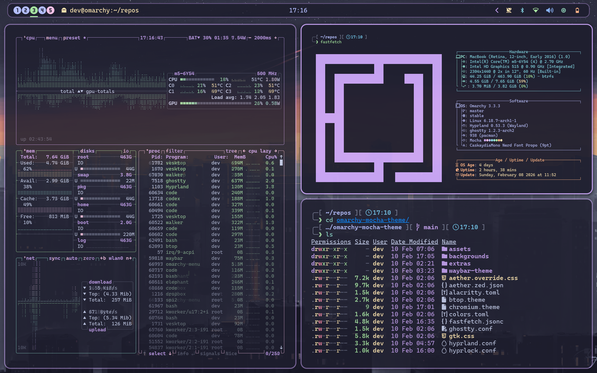

# Omarchy Mocha Theme

Mocha is the next Omarchy theme iteration, currently bootstrapped from the Aura2 layout so it stays installable while palette and styling evolve.

## Preview



## Install (Regular Omarchy)

Install from GitHub with Omarchy's native installer:

```bash
omarchy-theme-install https://github.com/gitcoder89431/omarchy-mocha-theme
```

Then set it (or re-set it later):

```bash
omarchy-theme-set mocha
```

Notes:
- `omarchy-theme-install` usually activates the theme automatically.
- Use `omarchy-theme-list` to confirm the exact folder/theme name.

## Install (ThemeManager+, Experimental)

ThemeManager+ support is useful, but treat this path as beta/experimental.

```bash
theme-manager install https://github.com/gitcoder89431/omarchy-mocha-theme
theme-manager set mocha -w
```

Useful commands:
- `theme-manager set mocha -w` applies theme plus the theme's `waybar-theme/`.
- `theme-manager waybar auto` reapplies only the current theme's Waybar config.
- `theme-manager` opens the interactive picker.

## Theme Structure

This repo is organized to work with Omarchy:

```text
omarchy-mocha-theme/
├── colors.toml
├── hyprland.conf
├── hyprlock.conf
├── waybar.css
├── waybar-theme/
│   ├── config.jsonc
│   └── style.css
├── backgrounds/
└── ... app/theme files
```

Key paths:
- `waybar-theme/` provides per-theme Waybar config.
- `hyprlock.conf` defines lockscreen palette variables.
- `colors.toml` drives generated template-based outputs in Omarchy.

## Included

- Hyprland (`hyprland.conf`)
- Hyprlock (`hyprlock.conf`)
- Waybar (`waybar.css`, `waybar-theme/`)
- VSCode/Cursor theme setter metadata (`vscode.json` -> `Catppuccin Mocha`)
- Terminals: Alacritty, Kitty, Ghostty, Warp
- Notifications/UI: mako, SwayOSD, GTK, Wofi
- Apps: Chromium, Vencord, Aether/Zed, Neovim theme config
- Utilities: btop theme, Walker theme

## Optional Extras

This repo includes a curated Catppuccin Mocha extras pack under `extras/` for:

- `fzf`
- `eza` (Mocha + Mauve accent)
- `helix`
- `zellij`
- `zed`
- Catppuccin Hypr files (`mocha.conf` + Hyprlock sample)
- Base16 Mocha reference

See `extras/README.md` for exact apply commands.

## Dependencies

Recommended:
- Nerd Font Propo family (CaskaydiaMono / Hack / JetBrains Mono Nerd Font Propo)
- DSEG font family for segmented clock display (optional)

## Credits

- Based on the original phosphor structure and Omarchy theme conventions.
- Thanks to @OldJobobo and contributors for the Waybar and ThemeManager+ compatibility improvements.
